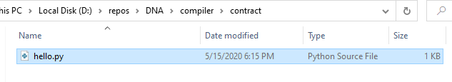
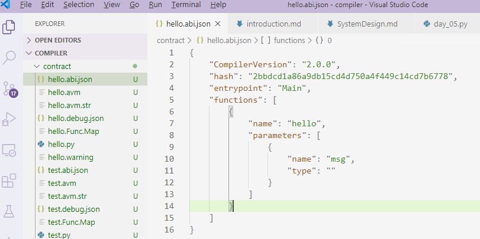
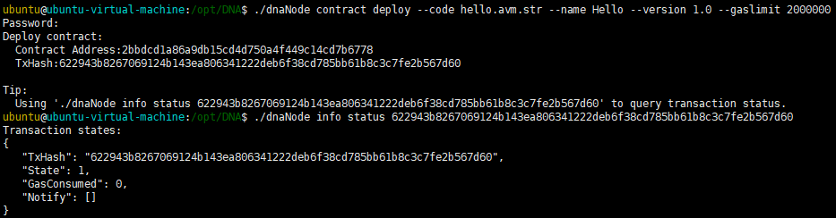
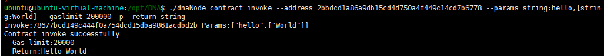
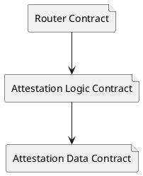

**《DNA智能合约教程》**

[TOC]

# 1. 概述

智能合约是一种旨在以信息化方式传播、验证或执行合约的计算机协议。

智能合约允许在没有第三方的情况下进行可信交易。这些交易可追踪且不可逆。

区块链技术给我们带来了一个去中心化的，不可篡改的，高可靠性的系统，在这种环境下，智能合约才大有用武之地。

智能合约是区块链最重要的特性之一，也是区块链能够被称为颠覆性技术的主要原因。

DNA智能合约的编写使用Python语言编写，在Python3 (3.6-3.8)的环境下编译，编译器项目所在地址为：
https://github.com/DNAProject/DNA-Python-Compiler


# 2. DNA智能合约入门

## 2.1. 示例1：Hello World

### 2.1.1. 首先来看一个最简单的 Hello World 智能合约:
```python
from DNA.interop.System.Runtime import Notify
from DNA.builtins import concat

def Main(operation, args):
    if operation =='hello':
        msg = args[0]
        return hello(msg)

def hello(msg):
    Notify(msg)
    return concat('Hello ', msg)

```

DNA中的合约以`Main`函数为入口，参数包扩要执行的合约方法和合约参数。
这个合约中只有`hello`这样一个合约方法，作用是接收用户参数`msg`，并返回 `Hello + msg`.

### 2.1.2. 接着我们需要编译这个合约
- 先下载编译器项目：
    ```shell
    $ cd /opt
    $ git clone https://github.com/DNAProject/DNA-Python-Compiler.git compiler
    $ cd compiler
    ```

- 在这个项目下创建contract目录，添加hello.py并使用示例代码：

    接着使用如下指令编译合约
    ```shell
    $ pip install -r requirements.txt
    $ python run.py -n contract/hello.py
    ```

- 编译成功后会在contract目录下生成abi和avm文件，其中abi文件会包含合约基本信息，avm.str文件包含上链所需的字节码：


### 2.1.3. 合约上链
- 首先复制hello.avm.str到节点服务器，使用如下命令部署合约：
    ```shell
    $ ./dnaNode contract deploy --code hello.avm.str --name Hello --version 1.0 --gaslimit 200000000
    ```
    成功后可以查看交易信息
    
    

- 合约部署成功后测试合约中的Hello方法：
    ```shell
    $ ./dnaNode contract invoke --address 4823bb5033670714b4e58cb8fc2ac3578e6b7a32 --params string:Hello,[string:World] --gaslimit 200000 -p -return string
    ```
    调用成功可以看到合约返回如下内容：


## 2.2. 示例2：Storage数据合约

每个智能合约都有自己的存储区，只有合约自身有写入权限，这里展示一下如何在存储区中写入和读取存储区中的内容:

```python
Cversion = '2.0.0'
from DNA.interop.System.Storage import GetContext, Get, Put, Delete
from DNA.interop.System.Runtime import Notify

Name = 'Storage'

def Main(operation, args):
    if operation == 'name':
        return name()
    if operation == 'getData':
        assert (len(args) == 1)
        key = args[0]
        return getData(key)
    if operation == 'setData':
        assert (len(args) == 2)
        key = args[0]
        value = args[1]
        return setData(key, value)
    if operation == 'deleteData':
        assert (len(args) == 1)
        key = args[0]
        return deleteData(key)
    return False

def name():
    return Name

def getData(key):
    sc = GetContext()
    Notify([Name, "getData", key])
    return Get(sc, key)

def setData(key, value):
    sc = GetContext()
    Put(sc, key, value)
    Notify([Name, "setData", key])
    return True

def deleteData(key):
    sc = GetContext()
    Delete(sc, key)
    Notify([Name, "deleteData", key])
    return True
```

这个合约中有4个合约方法，主要展示如何与存储区交互.


## 2.3. 示例3：静态合约调用

因为每个合约存储空间和合约哈希绑定，我们在实践中又有合约升级的需求，所以一般将数据合约与业务合约分开部署，这样升级时仅需要修改业务合约，不会破坏历史数据:

```python
Cversion = '2.0.0'
from DNA.builtins import concat, substr, len
from DNA.interop.System.Runtime import Notify, CheckWitness
from DNA.interop.System.App import RegisterAppCall
from DNA.interop.System.ExecutionEngine import GetScriptContainer
from DNA.interop.System.Transaction import GetTransactionHash

HistoryPrefix = 'History-'
Name = 'Proof Business'
OWNER = ToScriptHash("AQf4Mzu1YJrhz9f3aRkkwSm9n3qhXGSh4p")

GetMethod = 'getData'
SetMethod = 'setData'
CallStorage = RegisterAppCall('8297129d680ea7d72b4484a6f82aa337ea5c26c5', 'operation', 'args')

def Main(operation, args):
    if operation == 'name':
        return name()
    if operation == 'getData':
        assert (len(args) == 1)
        key = args[0]
        return getData(key)
    if operation == 'appendData':
        assert (len(args) == 2)
        key = args[0]
        value = args[1]
        return appendData(key, value)

def name():
    return Name

def getData(key):
    Notify([Name, "getData", key])
    return CallStorage(GetMethod, [key])

def appendData(key, value):
    # if CheckWitness(OWNER) == False:
    # return False

    historyKey = concat(HistoryPrefix, key)
    oldValue = CallStorage(GetMethod, [key])
    oldHistory = CallStorage(GetMethod, [historyKey])
    Notify([Name, "appendData", key])
    if oldHistory == None:
        newHistory = concat(concat('[', value), ']')
        return CallStorage(SetMethod, [historyKey, newHistory]) and CallStorage(SetMethod, [key, value])
    else:
        hisContent = substr(oldHistory, 1, len(oldHistory)-2)
        newHistory = concat(concat(concat(concat('[',hisContent),','), value),']')
        return CallStorage(SetMethod, [historyKey, newHistory]) and CallStorage(SetMethod, [key, value])
```

## 2.4. 示例4：动态合约调用

实践中有时需要动态地指定被调用合约的地址，比如通过一个路由合约统一管理多个合约调用的入口:

```python
Cversion = '2.0.0'
from DNA.libont import bytearray_reverse, hexstring2bytes
from DNA.interop.System.App import RegisterAppCall, DynamicAppCall
from DNA.interop.System.Runtime import Notify
from DNA.interop.System.Storage import GetContext, Get, Put, Delete

Name = 'Router'

def Main(operation, args):
    if operation == 'name':
        return name()
    if operation == 'setContract':
        assert (len(args) == 2)
        name = args[0]
        address = args[1]
        return setContract(name, address)
    if operation == 'callContract':
        assert (len(args) == 3)
        name = args[0]
        operation = args[1]
        params = args[2]
        return callContract(name, operation, params)
    return False

def name():
    return Name

def setContract(name, address):
    assert(len(address) == 40)
    reversedContractAddress = bytearray_reverse(hexstring2bytes(address))
    Put(GetContext(), name, reversedContractAddress)
    Notify([Name, "setContract", name, address])
    return True

def callContract(name, operation, params):
    reversedContractAddress = Get(GetContext(), name)
    res = DynamicAppCall(reversedContractAddress, operation, params)
    Notify([Name, "callContract", name, operation])
    return res
```

综合使用静态与动态合约调用，我们可以使用如下架构的合约设计，实现简化的调用方式和灵活的合约升级：



## 2.5. 示例5：对象的序列化和反序列化

合约存储对象时要通过`Serialize`把对象进行序列化，获取序列化后的对象后可以通过`Deserialize`方法还原:

```python
Cversion = '2.0.0'
from DNA.libont import bytearray_reverse, hexstring2bytes
from DNA.interop.System.App import RegisterAppCall, DynamicAppCall
from DNA.interop.System.Runtime import Notify, Serialize, Deserialize
from DNA.interop.System.Storage import GetContext, Get, Put, Delete
from DNA.builtins import append, remove, concat, keys

MAPKEY = "Map"

def Main(operation, args):
    if operation == "init":
        return init()
    if operation == "add_map":
        key = args[0]
        value = args[1]
        return add_map(key, value)
    if operation == "remove_map":
        key = args[0]
        return remove_map(key)
    if operation == "list_keys":
        return list_keys()
    return False

def init():
    # init map
    map1 = {
        "key1": 1,
        "key2": 2
    }
    map1Info = Serialize(map1)
    Put(GetContext(), MAPKEY, map1Info)
    # return result
    Notify(["init map is ", map1["key1"], map1["key2"]])

    return True


def add_map(key, value):
    map1Info = Get(GetContext(), MAPKEY)
    map1 = Deserialize(map1Info)

    Notify(["before add, map is ", map1["key1"], map1["key2"]])
    # add data 
    map1[key] = value
    map1Info = Serialize(map1)
    Put(GetContext(), MAPKEY, map1Info)
    Notify(["after add, map is ", map1["key1"], map1["key2"], map1[key]])

    return True


def remove_map(key):
    map1Info = Get(GetContext(), MAPKEY)
    map1 = Deserialize(map1Info)
    Notify(["before remove, map is ", map1["key1"], map1["key2"], map1[key]])
    map1.remove(key)
    map1Info = Serialize(map1)
    Put(GetContext(), MAPKEY, map1Info)
    Notify(["after remove, map is ", map1["key1"], map1["key2"]])
    return True

def list_keys():
    map1Info = Get(GetContext(), MAPKEY)
    map1 = Deserialize(map1Info)

    keys = map1.keys()
    res = "["
    for key in keys:
        res = concat(concat(res, key), ",")
    res = concat(res, "]")
    return res
```

## 2.6. 相关参考

1. [DNA智能合约编译器，包含常见合约操作的示例](https://github.com/DNAProject/DNA-Python-Compiler)

2. DNA项目节点[代码](https://github.com/DNAProject/DNA)及[部署文档](https://github.com/DNAProject/DNA/blob/master/README_CN.md)

3. [DNA智能合约常见问题](https://github.com/DNAProject/Documentation/blob/master/docs-cn/smartcontract/05-sc-faq.md)

